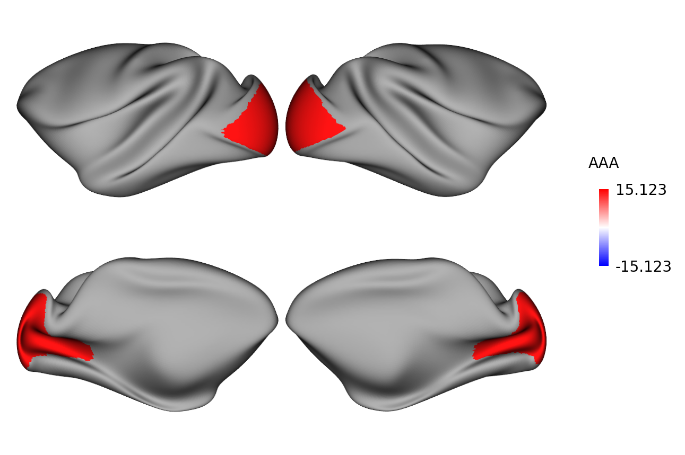
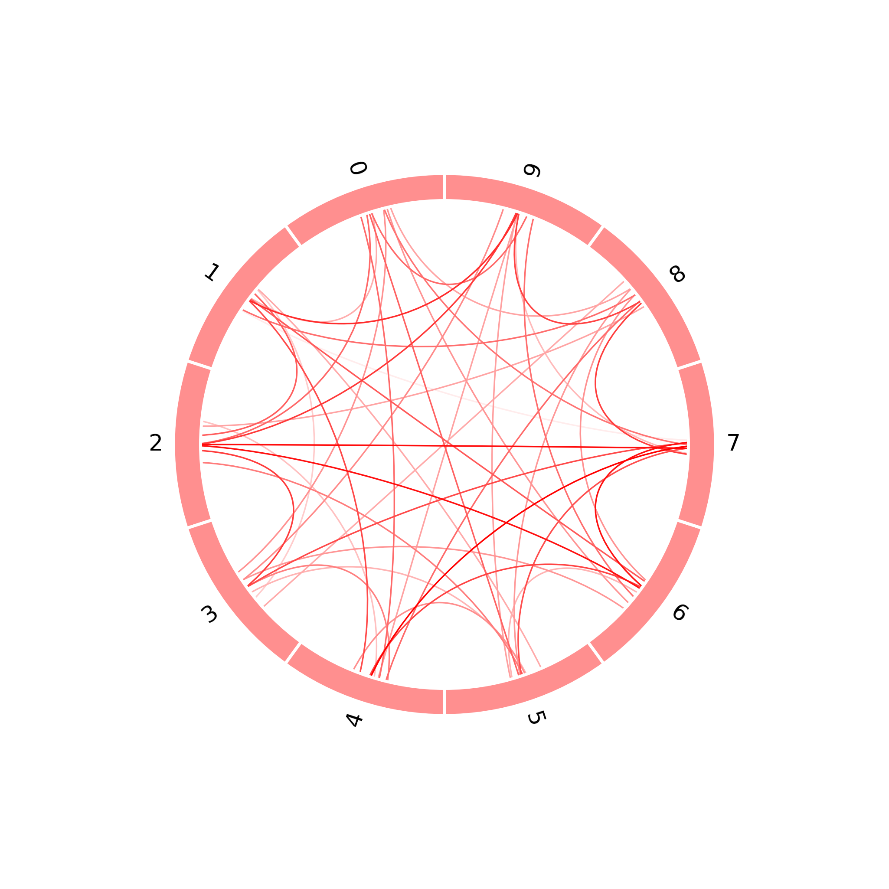
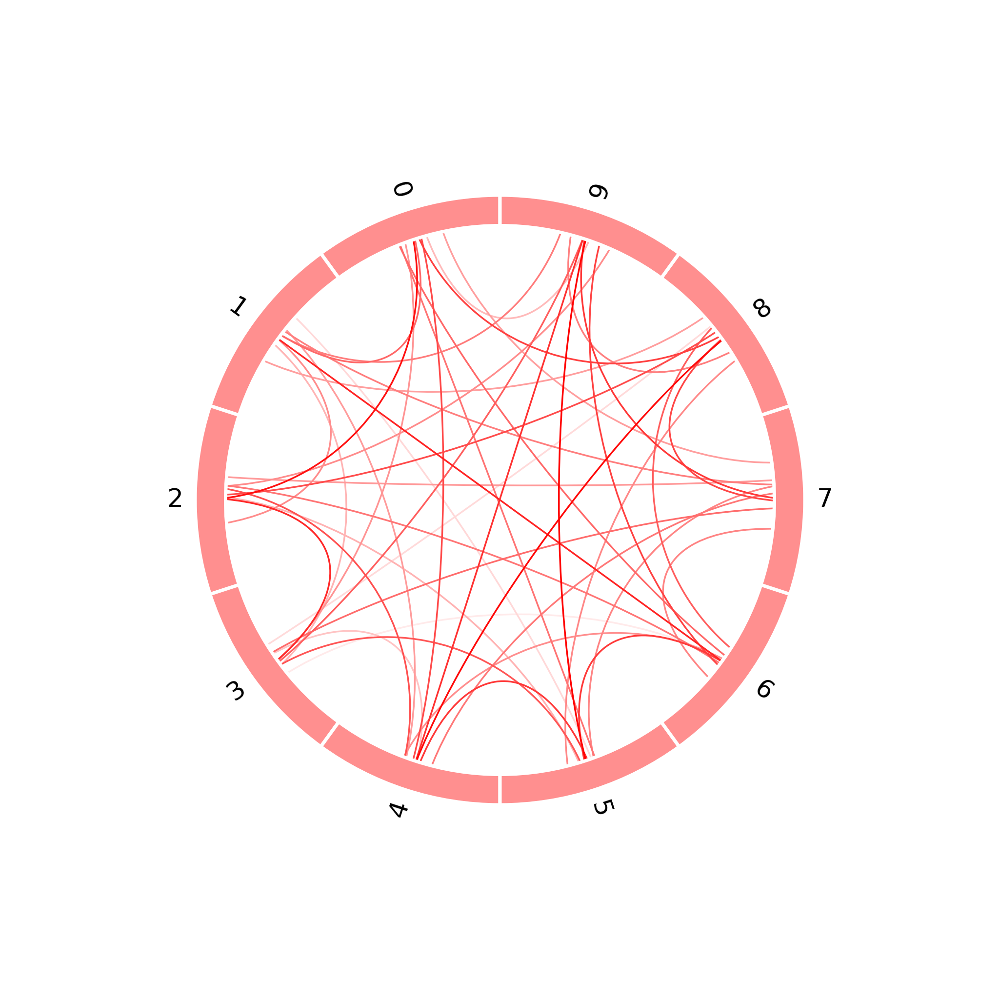

# 写在最前面

## 重要！！！修改原neuromaps库中的部分文件！！！重要

1. 请将`python_package_path\neuromaps\datasets\atlases.py`替换为`Plot_figure/temp/atlases.py`
2. 请将`python_package_path\neuromaps\datasets\__init__.py`替换为`Plot_figure/temp/__init__.py`
3. 请将`python_package_path\neuromaps\datasets\data\osf.json`替换为`Plot_figure/temp/osf.json`


# Plot Figure

**使用示例见`example.ipynb`，示例图见文件夹`example_figures`（更新比较勤）**

	

	
	

# 一. 简介

`Plot_figure`是一个用于认知神经领域科研绘图的python包，并且可以完成简单的统计检验并自动标星号。

主要包括6种图：

1. 单组bar图
2. 单组小提琴图
3. 矩阵图
4. 点线相关图
5. 脑图
   1. 人类Glasser脑区图
   2. 猕猴CHARM5脑区图
6. 圈状图（circos图）
   1. 对称
   2. 不对称

> 基本知识，一张图中的基本元素的名字：
>
> 
>
> 提问：fig，ax，ylabel，xlabel，xtick，legend是什么？


# 二. python依赖

## 1. python包的安装

使用前需安装：

- `numpy`
- `pandas`
- `matplotlib`
- `statsmodels`
- `scipy`
- `mne-connectivity`
- `mne`
- `neuromaps` **（需要修改该包中的部分文件）**
- `surfplot`

安装包均可在终端使用以下命令完成：

```bash
pip install <package_name> -i https://pypi.tuna.tsinghua.edu.cn/simple
```
