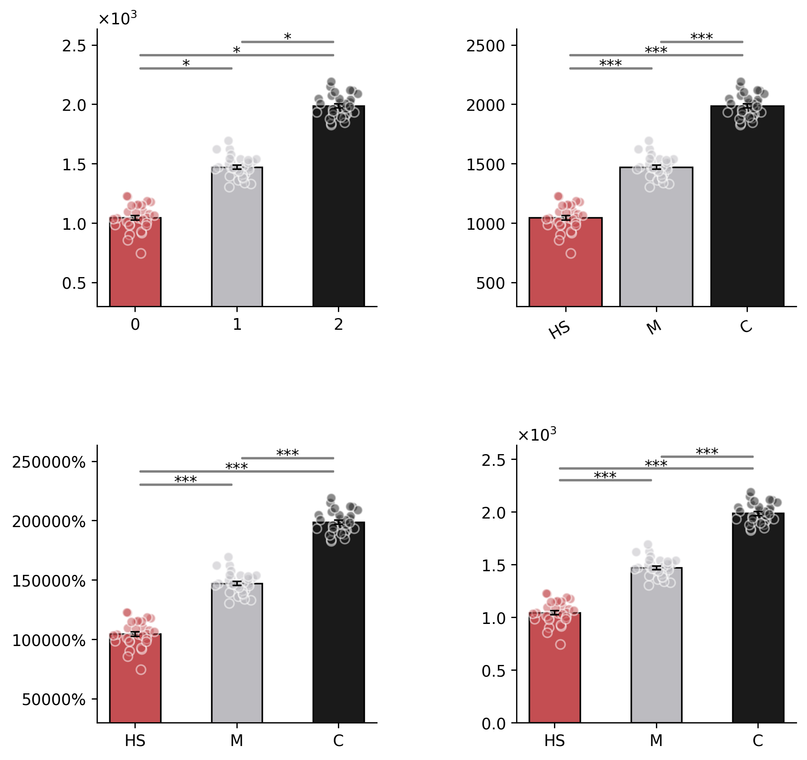
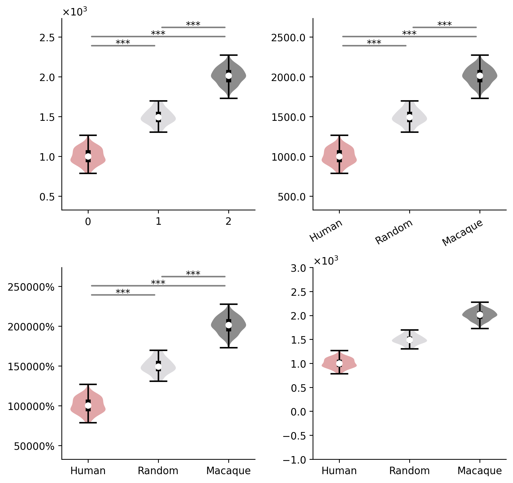
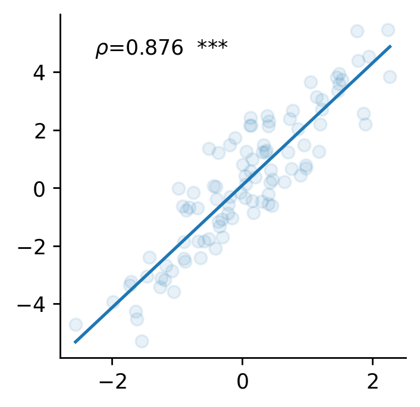
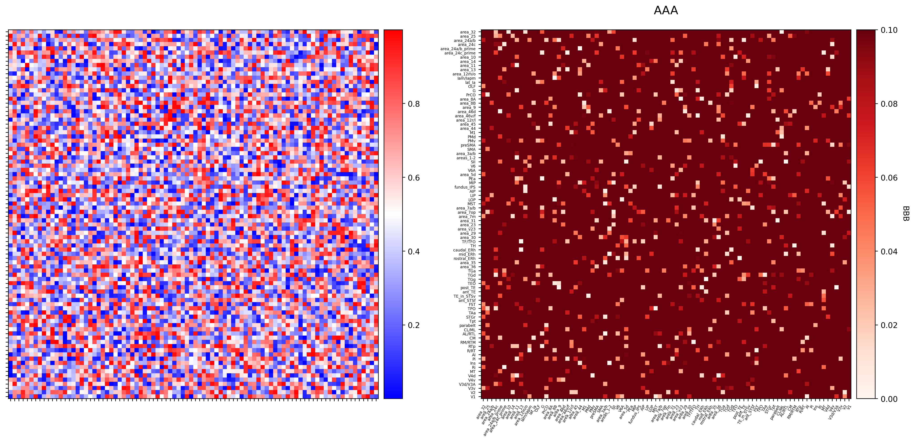
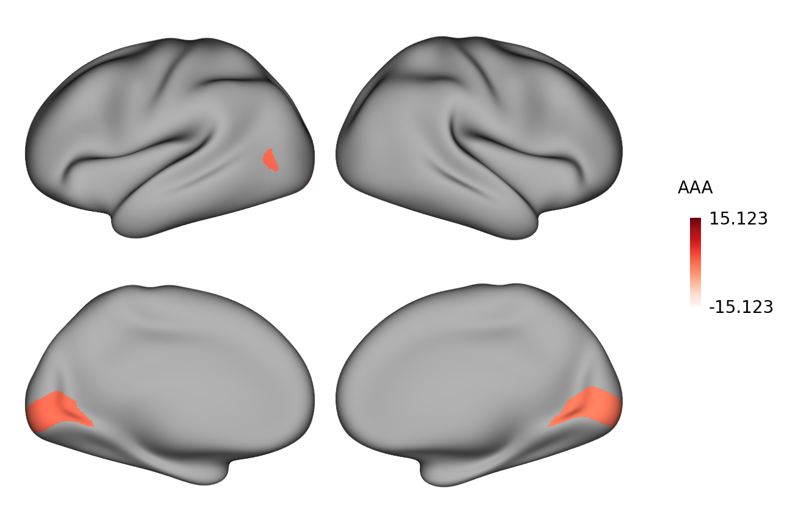
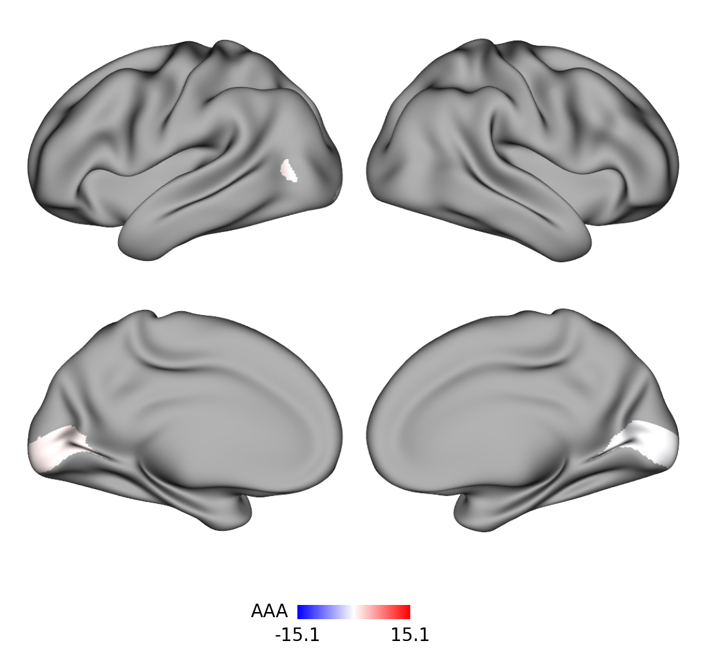
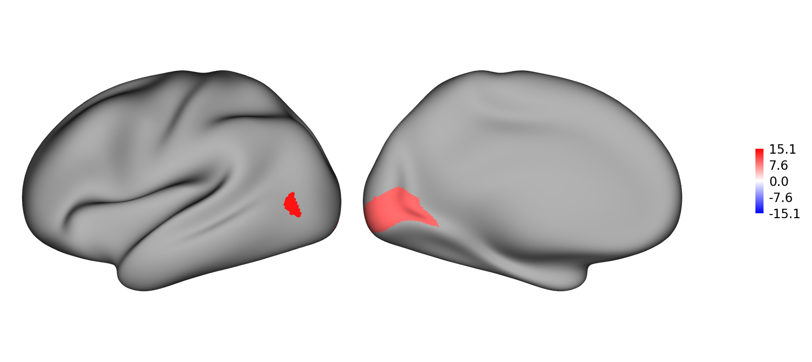
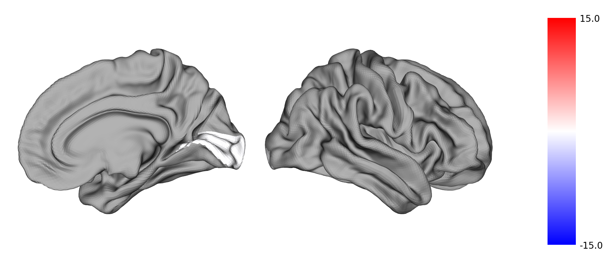

# 一. 简介

`Plot_figure`一个用于认知神经领域科研绘图的python包，并且可以完成简单的统计检验并自动标星号。


# 二. 代码介绍

## 1. 单组bar图

### 1.1 代码演示：

```python
import numpy as np
import matplotlib.pyplot as plt
from Plot_figure import *  # 从Plot_figure文件夹中的plot_figure.py文件中导入所有函数


# 出于演示目的，随机生成3组数据
np.random.seed(0)
Human = np.random.normal(1000,100,30)
Macaque = np.random.normal(1500,100,30)
Chimpanzee = np.random.normal(2000,100,30)
# 导入数据
data = [Human, Macaque, Chimpanzee]
labels_name = ['H', 'M', 'C']
colors = ['#c44e52','#bcbbc0', '#1a1a1a']  # 自定义颜色（十六进制）
# 设置figure
fig, axes = plt.subplots(2, 2, figsize=(8,8))  # 2行2列，共4个子图
fig.subplots_adjust(wspace=0.3, hspace=0.3)  # 设置子图间间距
# 设置axes
ax1 = axes[0][0]  # 第1行，第1列子图
ax2 = axes[0][1]  # 第1行，第2列子图
ax3 = axes[1][0]  # 第2行，第1列子图
ax4 = axes[1][1]  # 第2行，第2列子图
# 调用函数
## 第1张ax
plot_one_group_bar_figure(data, ax=ax1, colors=colors)
## 第2张ax
plot_one_group_bar_figure(data, ax=ax2, width=0.8, labels_name=labels_name, colors=colors, math_text=False, x_tick_rotation=30, x_label_ha='right', statistic=True)
## 第3张ax
plot_one_group_bar_figure(data, ax=ax3, labels_name=labels_name, colors=colors, math_text=False, percentage=True, statistic=True, test_method='permutation_median')
## 第4张ax
plot_one_group_bar_figure(data, ax=ax4, labels_name=labels_name, colors=colors, ax_min_is_0=True, statistic=True, test_method='ttest_rel')
# 保存图片
fig.savefig("./figures/single_bar.png", dpi=250, bbox_inches='tight')  # 保存到指定位置，以及设置图片清晰度（越清晰，图片越大），矢量图保存可以换成.svg格式
```



### 1.2 函数介绍

函数名字：`plot_one_group_bar_figure`

参数（大部分参数都有默认值，如无需要，不需更改）：

- ```
  data: 输入的数据；列表
  ```

- ```
  ax: 子图
  ```

- ```
  labels_name: 横坐标上每一个bar的名字，上例中的“H, M, C”；列表
  ```
  
- ```
  x_tick_fontsize: 横坐标上每一个bar的名字字体大小；数值
  ```

- ```
  x_tick_rotation: 横坐标上每一个bar的名字旋转角度；数值
  ```

- ```
  x_label_ha: 横坐标上每一个bar的名字旋转的中心位置；'center'/'left'/'right'（以“center和right”为最常用）
  ```

- ```
  width: bar的宽度；数值
  ```

- ```
  colors: 每个bar的颜色；列表
  ```

- ```
  title_name: 子图标题；字符串
  ```

- ```
  title_fontsize: 子图标题字体大小；数值
  ```

- ```
  title_pad: 子图标题与子图间距；间距
  ```

- ```
  x_label_name: x轴标题；字符串
  ```

- ```
  x_label_fontsize: x轴标题字体大小；数值
  ```

- ```
  y_label_name: y轴标题；字符串
  ```

- ```
  y_label_fontsize: y轴标题字体大小；数值
  ```

- ```
  y_tick_fontsize: y轴tick字体大小；数值
  ```

- ```
  y_tick_rotation: y轴tick字体旋转角度；数值
  ```

- ```
  y_max_tick_to_one: y轴最大值是否设置为1；True/False（在特殊场景下，y>1没有意义时可以使用，例如相关性系数）
  ```

- ```
  y_max_tick_to_value: 配合上个参数使用；数值（在特殊场景下，y>“某个数”没有意义时可以使用，使y轴不显示大于该数的值）
  ```
  
- ```
  y_lim_range: y轴最大值和最小值；列表（默认为None，手动设置，例如[0,10]，则指定y轴上只显示0~10的数据）
  ```
  
- ```
  math_text: y轴是否采用科学计数法显示；True/False
  ```
  
- ```
  one_decimal_place: y轴是否保留1位小数；True/False
  ```
  
- ```
  percentage: y轴是否采用百分数显示；True/False
  ```
  
- ```
  ax_min_is_0: y轴最小值是否为0；True/False（在特殊场景下，y<0没有意义时可以使用，例如脑体积大小）
  ```
  
- ```
  statistic: 是否需要进行统计检验；True/False（在已有统计方法不适用的情况下，可以禁用自动统计，后续手动统计、标星号）
  ```
  
- ```
  asterisk_fontsize: 星号大小；数值
  ```
  
- ```
  multicorrect: 是否多重比较校正；True/False 
  ```
  
- ```
  test_method: 统计方法；'ttese_ind 独立样本t检验'/'ttest_rel 配对样本t检验'/'mannwhitneyu 非参数检验'/'permutation_mean Permutation检验（mean值）'/'permutation_median Permutation检验（median值）'
  ```

### 1.3 关于统计检验

统计检验方法，目前仅包括：

- 独立样本t检验，双尾
- 配对样本t检验，双尾
- Mann Whitney U 非参数检验，双尾
- permutation检验，双尾，采样数10000
  - mean
  - median

多重比较校正为Bonferroni校正，及将p值乘以比较次数。


## 2. 单组小提琴图

### 2.1 代码演示：

```bash
import numpy as np
import matplotlib.pyplot as plt
from Plot_figure import *  # 从Plot_figure文件夹中的plot_figure.py文件中导入所有函数

# 出于演示目的，随机生成3组数据
np.random.seed(1998)
Human = np.random.normal(1000,100,100)
Random = np.random.normal(1500,100,100)
Macaque = np.random.normal(2000,100,100)
# 导入数据
data=[Human, Random, Macaque]
labels_name = ['Human', 'Random', 'Macaque']
colors=['#c44e52','#bcbbc0', '#1a1a1a']
# 设置figure
fig = plt.figure(figsize=(8,8))
plt.subplots_adjust(wspace=0.3, hspace=0.3)
# 设置axes
ax1 = fig.add_subplot(221)
ax2 = fig.add_subplot(222)
ax3 = fig.add_subplot(223)
ax4 = fig.add_subplot(224)
# 调用函数
## 第1张ax
plot_one_group_violin_figure(data, ax=ax1, colors=colors, statistic=True)
## 第2张ax
plot_one_group_violin_figure(data, ax=ax2, labels_name=labels_name, colors=colors, math_text=False, one_decimal_place=True, x_tick_rotation=30, x_label_ha='right', statistic=True,  test_method='permutation_mean')
## 第3张ax
plot_one_group_violin_figure(data, ax=ax3, labels_name=labels_name, colors=colors, math_text=False, percentage=True, statistic=True, test_method='ttest_rel')
## 第4张ax
plot_one_group_violin_figure(data, ax=ax4, labels_name=labels_name, colors=colors, y_lim_range=[-1000, 3000])
# 保存图片
fig.savefig("./figures/single_violin.png", dpi=250, bbox_inches='tight')
```



### 2.2 函数介绍

函数名字：`plot_one_group_violin_figure`

参数，与[1.2 函数介绍](# 1.2 函数介绍)相同

### 2.3 关于统计检验

与[1.3 关于统计检验](# 1.3 关于统计检验)相同


## 3. 点线相关图

### 3.1 代码演示

```python
import numpy as np
import matplotlib.pyplot as plt
from Plot_figure import *  # 从Plot_figure文件夹中的plot_figure.py文件中导入所有函数

# 出于演示目的，生成随机数据
np.random.seed(0)
rm_rjx1 = np.random.normal(0, 1, 100)
rm_rjx2 = 2 * rm_rjx1 + np.random.normal(0, 1, 100)
# 设置figure
fig = plt.figure(figsize=(3, 3))
# 设置axes
ax = fig.add_subplot(111)
# 调用函数
plot_correlation_figure(rm_rjx1, rm_rjx2, stats_method='spearman', summary=True)
# 保存图片
fig.savefig(r"./figures/correlation.png",dpi=250, bbox_inches='tight')  # 保存到指定位置，以及设置图片清晰度（越清晰，图片越大），矢量图保存可以换成.svg格式
```



### 3.2 函数介绍

函数名字：`plot_correlation_figure`

参数（大部分参数都有默认值，如无需要，不需更改）：

- ```
  data1: x轴数据；列表
  ```

- ```
  data2: y轴数据；列表
  ```

- ```
  ax: 子图
  ```

- ```
  stats_method: Pearson相关还是Spearman相关；'pearson'/'spearman'
  ```

- ```
  dots_color: 点的颜色；十六进制颜色
  ```

- ```
  line_color: 线的颜色；十六进制颜色
  ```

- ```
  title_name: 子图标题；字符串
  ```

- ```
  title_fontsize: 子图标题字体大小；数值
  ```

- ```
  title_pad: 子图标题与子图间距；间距
  ```

- ```
  x_label_name: x轴标题；字符串
  ```

- ```
  x_label_fontsize: x轴标题字体大小；数值
  ```

- ```
  x_tick_fontsize: x轴tick字体大小；数值
  ```

- ```
  x_tick_rotation: x轴tick字体旋转角度；数值
  ```

- ```
  x_major_locator: x轴各个tick之间的距离；数值
  ```

- ```
  x_max_tick_to_one: x轴最大值是否设置为1；True/False（在特殊场景下，x>1没有意义时可以使用，例如相关性系数）
  ```

- ```
  x_max_tick_to_value: 配合上个参数使用；数值（在特殊场景下，x>“某个数”没有意义时可以使用，使y轴不显示大于该数的值）
  ```
  
- ```
  x_math_text: x轴是否采用科学计数法显示；True/False
  ```

- ```
  x_one_decimal_place: x轴是否保留1位小数；True/False
  ```
  
- ```
  x_percentage: x轴是否采用百分数显示；True/False
  ```

- ```
  y_label_name: y轴标题；字符串
  ```
  
- ```
  y_label_fontsize: y轴标题字体大小；数值
  ```

- ```
  y_tick_fontsize: y轴tick字体大小；数值
  ```
  
- ```
  y_tick_rotation: y轴tick字体旋转角度；数值
  ```

- ```
  y_major_locator: y轴各个tick之间的距离；数值
  ```
  
- ```
  y_max_tick_to_one: y轴最大值是否设置为1；True/False（在特殊场景下，y>1没有意义时可以使用，例如相关性系数）
  ```

- ```
  y_max_tick_to_value: 配合上个参数使用；数值（在特殊场景下，y>“某个数”没有意义时可以使用，使y轴不显示大于该数的值）
  ```
  
- ```
  y_math_text: y轴是否采用科学计数法显示；True/False
  ```

- ```
  y_one_decimal_place: y轴是否保留1位小数；True/False
  ```
  
- ```
  y_percentage: y轴是否采用百分数显示；True/False
  ```

- ```
  asterisk_fontsize: 星号大小；数值
  ```
  
- ```
  summary: 总结线性模型拟合结果；True/False
  ```


## 4. 矩阵图

### 4.1 代码演示

```python
import numpy as np
import matplotlib.pyplot as plt
from Plot_figure import *  # 从Plot_figure文件夹中的plot_figure.py文件中导入所有函数

# 数据
np.random.seed(1998)
data1 = np.random.random((88,88))
data2 = np.random.random((88,88))
labels = ['area_32','area_25','area_24a/b','area_24c','area_24a/b_prime','area_24c_prime','area_10','area_14','area_11','area_13','area_12m/o','Iam/Iapm','lat_Ia','OLF','G','PrCO','area_8A','area_8B','area_9','area_46d','area_46v/f','area_12r/l','area_45','area_44','M1','PMd','PMv','preSMA','SMA','area_3a/b','areas_1-2','SII','V6','V6A','area_5d','PEa','MIP','fundus_IPS','AIP','LIP','LOP','MST','area_7a/b','area_7op','area_7m','area_31','area_23','area_v23','area_29','area_30','TF/TFO','TH','caudal_ERh','mid_ERh','rostral_ERh','area_35','area_36','TGa','TGd','TGg','TEO','post_TE','ant_TE','TE_in_STSv','ant_STSf','FST','TPO','TAa','STGr','Tpt','parabelt','CL/ML','AL/RTL','CM','RM/RTM','RTp','R/RT','AI','Pi','Ins','Ri','MT','V4d','V4v','V3d/V3A','V3v','V2','V1']
# figure的参数额外设置
fig = plt.figure(figsize=(20,10))
# axes的参数额外设置
ax1 = fig.add_subplot(121)
ax2 = fig.add_subplot(122)
# 调用函数
## 第1张ax
plot_matrix_figure(data1, ax=ax1)
## 第2张ax
plot_matrix_figure(data2, ax=ax2, row_labels_name=labels, col_labels_name=labels, cmap='Reds', colorbar=True, colorbar_label_name='BBB', title_name='AAA', vmin=0, vmax=0.1)
# 保存图片
fig.savefig("./figures/matrix.png", dpi=250, bbox_inches='tight')
```



### 4.2 函数介绍

函数名字：`plot_matrix_figure`

参数（大部分参数都有默认值，如无需要，不需更改）：

- ```
  data: 输入的数据；2维numpy数组
  ```
  
- ```
  ax: 子图
  ```
  
- ```
  row_labels_name: 每一列的名字；列表
  ```
  
- ```
  col_labels_name: 每一行的名字，列表
  ```
  
- ```
  row_labels_fontsize: 每一列的名字的大小；数值
  ```
  
- ```
  col_labels_fontsize: 每一行的名字的大小；数值
  ```
  
- ```
  cmap: 颜色主题；字符串（默认“bwr”，更多主题见：https://matplotlib.org/stable/gallery/color/colormap_reference.html#sphx-glr-gallery-color-colormap-reference-py）
  ```
  
- ```
  colorbar: 是否显示colorbar；True/False
  ```
  
- ```
  colorbar_label_name: colorbar名字；字符串
  ```
  
- ```
  colorbar_label_fontsize: colorbar的label的字体大小
  ```
  
- ```
  colorbar_label_pad: colorbar与主图之间的间隔；数值
  ```
  
- ```
  colorbar_tick_fontsize: colorbar的tick的字体大小；数值
  ```
  
- ```
  colorbar_tick_rotation: colorbar的tick的字体旋转角度；数值
  ```
  
- ```
  x_rotation: 每一列的名字的旋转角度；数值
  ```
  
- ```
  title_name: 子图标题名字；字符串
  ```
  
- ```
  title_fontsize: 子图标题字体大小；数值
  ```
  
- ```
  title_pad: 子图标题与子图间距；间距
  ```
  
- ```
  vmax: colorbar显示最大值；数值
  ```
  
- ```
  vmin: colorbar显示最小值；数值
  ```
  
- ```
  aspect: 矩阵的每个cell是否维持方形；数值，默认'equal'（如果是数值，则指定每个cell的宽是长的多少倍）
  ```


## 5. 人Glasser脑图

### 5.1 代码演示

```python
import numpy as np
import matplotlib.pyplot as plt
from Plot_figure import *

data = {'lh_V1':10, 'lh_MST':15, 'rh_V1':-10}

# 全脑1
fig = plot_human_brain_figure(data, cmap='Reds', vmin=-15.1234, vmax=15.1234, colorbar_label_name='AAA', colorbar_decimals=3)
fig.savefig(r"./figures/human_brain1.png", dpi=250, bbox_inches='tight')

# 全脑2
fig = plot_human_brain_figure(data, surf='inflated', cmap='bwr', vmin=-15.1234, vmax=15.1234, colorbar_label_name='AAA', colorbar_location='bottom')
fig.savefig(r"./figures/human_brain2.png", dpi=250, bbox_inches='tight')

# 仅左脑
fig = plot_human_hemi_brain_figure(data, hemi='lh', cmap='bwr', vmin=-15.1234, vmax=15.1234, colorbar_nticks=5)
fig.savefig(r"./figures/human_brain3.png", dpi=250, bbox_inches='tight')

# 仅右脑
fig = plot_human_hemi_brain_figure(data, hemi='rh', surf='midthickness', cmap='bwr', vmin=-15, vmax=15, colorbar_shrink=0.9)
fig.savefig(r"./figures/human_brain4.png", dpi=250, bbox_inches='tight')
```

	

---

	

### 5.2 函数介绍

#### 5.2.1 全脑

函数名字：`plot_human_brain_figure`，

参数（大部分参数都有默认值，如无需要，不需更改）：

- ```
  data: 输入的数据，一般情况下是字典，也可以指定.csv文件
  ```
  
- ```
  surf: underlay的surface图形选择；'veryinflated'（默认）/'inflated'/'midthickness'/'sphere'
  ```
  
- ```
  cmap: 颜色主题；字符串（默认“bwr”，更多主题见：https://matplotlib.org/stable/gallery/color/colormap_reference.html#sphx-glr-gallery-color-colormap-reference-py）
  ```
  
- ```
  vmin: colorbar显示最小值；数值
  ```
  
- ```
  vmax: colorbar显示最大值；数值
  ```
  
- ```
  colorbar: 是否显示colorbar；True/False
  ```
  
- ```
  colorbar_location: colorbar的显示位置；'right'/'bottom'
  ```
  
- ```
  colorbar_label_name: colorbar名字；字符串
  ```
  
- ```
  colorbar_label_rotation: colorbar名字的旋转角度；数值
  ```
  
- ```
  colorbar_decimals: colorbar中tick保留的小数位数；整数
  ```
  
- ```
  colorbar_fontsize: colorbar的名字的字体大小
  ```
  
- ```
  colorbar_nticks: colorbar上需要标几个tick；自然数
  ```
  
- ```
  colorbar_shrink: colorbar的大小
  ```
  
- ```
  colorbar_aspect: colorbar的长宽比；数值
  ```
  
- ```
  colorbar_draw_border: colorbar是否标出黑色轮廓；True/False
  ```
  

#### 5.2.2 半脑

函数名字：`plot_human_hemi_brain_figure`

参数，大部分与[5.2.1 全脑](# 5.2.1 全脑)相同，仅增加一项（大部分参数都有默认值，如无需要，不需更改）：

- ```
  hemi: 半脑；'lh'/'rh'
  ```


## 6. 猴CHARM5脑图

同人类脑图函数。
